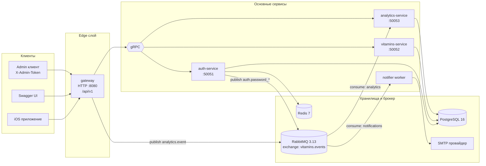
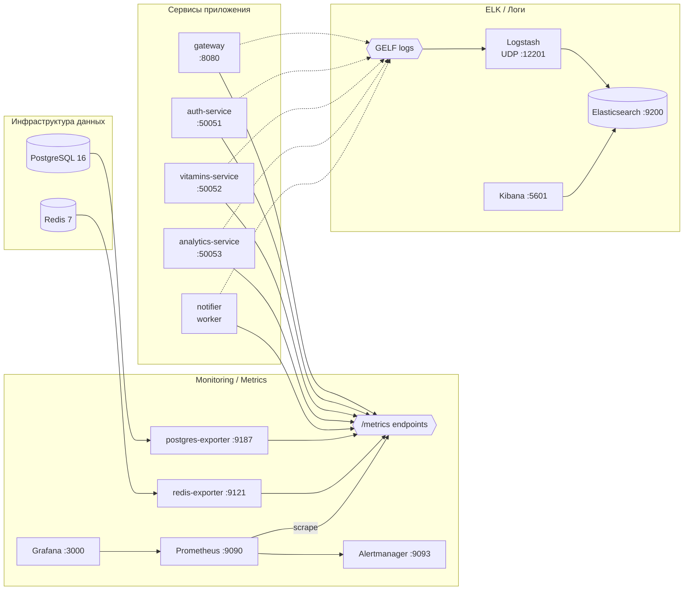

# Vitamins Backend

Бэкенд-платформа для мобильного приложения VitaInfo.

Проект реализован как микросервисный бэкенд:
- `gateway` — HTTP API для клиентов
- `auth-service` — аутентификация, профиль, смена/сброс пароля
- `vitamins-service` — каталог и напоминания
- `analytics-service` — события, consent, экспорт
- `notifier` — асинхронная отправка email через RabbitMQ

Инфраструктура локального/стендового запуска:
- PostgreSQL, Redis, RabbitMQ
- Prometheus, Grafana, Alertmanager
- Elasticsearch, Logstash, Kibana

---

## Содержание

- [Архитектура](#архитектура)
- [Технологический стек](#технологический-стек)
- [Структура репозитория](#структура-репозитория)
- [Быстрый старт](#быстрый-старт)
- [Публичные эндпоинты](#публичные-эндпоинты)
- [Маршруты API](#маршруты-api)
- [Тестирование](#тестирование)
- [Варианты docker compose](#варианты-docker-compose)
- [Хранение данных](#хранение-данных)
- [Диагностика проблем](#диагностика-проблем)
- [Полезные команды](#полезные-команды)

---

## Архитектура

### Runtime (основной поток запросов)



### Observability (метрики и логи)



Редактируемые источники:
- `docs/architecture/system-architecture.md`
- `docs/architecture/observability-architecture.md`


---

## Технологический стек

- Go `1.25`
- Транспорт: HTTP (Gin), gRPC, Protocol Buffers
- БД: PostgreSQL 16 (`pgx`, `sqlc`, SQL-миграции)
- Кэш: Redis 7
- Очередь сообщений: RabbitMQ `3.13`
- Аутентификация: JWT (access + refresh), `bcrypt`
- Логирование: `log/slog` (JSON)
- Наблюдаемость:
  - метрики: Prometheus + Grafana + Alertmanager
  - infra-метрики: `postgres-exporter`, `redis-exporter`
  - логи: Elasticsearch + Logstash + Kibana
- Документация API: Swagger UI (`swaggo`)
- Инфраструктура запуска: Docker Compose, Makefile
- CI: GitHub Actions (`.github/workflows/ci.yml`) — lint (golangci-lint), unit, integration, e2e, docker build
- Тестирование: `go test`, `testify`, `httptest`, `httpexpect`, `mockery`, `testifylint`, `go-cmp`

---

## Структура репозитория

```text
services/
  gateway/        # HTTP API gateway
  auth/           # auth gRPC service
  vitamins/       # vitamins/reminders gRPC service
  analytics/      # analytics gRPC service
  notifier/       # async mail worker

pkg/
  db/             # sqlc + migrations + seed
  logger/         # slog middleware/helpers
  metrics/        # prometheus middleware/collectors
  rabbitmq/       # publisher/consumer/events
  cache/          # redis store

deploy/
  docker-compose.yml        # полный стек 
  docker-compose.app.yml    # только приложение
  docker-compose.data.yml   # только инфраструктура

monitoring/       # конфиги Prometheus/Grafana/Alertmanager
elk/              # конфиги Logstash/Kibana/Elasticsearch
proto/            # gRPC контракты
```

---

## Быстрый старт

### 1) Требования

- Docker Engine + Docker Compose v2
- `make`

### 2) Настройка окружения

Создай `.env` в корне проекта (минимум для запуска сервисов):

```env
JWT_SECRET=change_me
ADMIN_TOKEN=change_me_admin

SMTP_HOST=smtp.example.com
SMTP_PORT=587
SMTP_USER=mailer@example.com
SMTP_PASS=change_me
SMTP_FROM=mailer@example.com

# опционально
REDIS_PASSWORD=
REDIS_DB=0
```

Расширенный пример для стенда/production-профиля:

```env
# Обязательные
JWT_SECRET=change_me
ADMIN_TOKEN=change_me_admin

SMTP_HOST=smtp.example.com
SMTP_PORT=587
SMTP_USER=mailer@example.com
SMTP_PASS=change_me
SMTP_FROM=mailer@example.com

# Логирование и окружение
LOG_LEVEL=info
APP_ENV=production
SERVICE_VERSION=dev

# JWT TTL
ACCESS_TOKEN_TTL=15m
REFRESH_TOKEN_TTL=720h

# Password reset/change
RESET_CODE_TTL=10m
RESET_SESSION_TTL=15m
RESET_MAX_ATTEMPTS=5
RESET_RATE_LIMIT=1m

# Redis (опционально)
REDIS_PASSWORD=
REDIS_DB=0
```

> `.env` исключен из git (`.gitignore`).

### 3) Запуск полного стека

```bash
make docker-up
```

Эквивалент:

```bash
docker compose -f deploy/docker-compose.yml up -d --build
```

### 4) Проверка

```bash
docker compose -f deploy/docker-compose.yml ps
curl -fsS http://localhost:8080/healthz
curl -fsS http://localhost:8080/readyz
```

---

## Публичные эндпоинты

| Компонент | URL |
|---|---|
| Gateway API | `http://localhost:8080` |
| Swagger UI | `http://localhost:8080/swagger/index.html` |
| Метрики gateway | `http://localhost:8080/metrics` |
| RabbitMQ UI | `http://localhost:15672` |
| Prometheus | `http://localhost:9090` |
| Grafana | `http://localhost:3000` |
| Alertmanager | `http://localhost:9093` |
| Elasticsearch | `http://localhost:9200` |
| Kibana | `http://localhost:5601` |

Локальные дефолтные учетные данные (из compose):
- RabbitMQ: `vitamins / vitamins`
- Grafana: `admin / admin`

---

## Маршруты API
- Auth: регистрация, вход, refresh token, сброс и смена пароля
- User: профиль текущего пользователя
- Vitamins: каталог витаминов и пользовательские напоминания
- Analytics: события, consent, экспорт
- Admin: экспорт аналитики, требует `X-Admin-Token`

Полная схема запросов/ответов — в Swagger.

---

## Тестирование

Все команды доступны через `make`:

```bash
make test-unit
make test-integration
make test-e2e
make testifylint
make test-all
```

Примечания:
- Integration/E2E используют отдельную БД `vitamins_test`.
- Makefile автоматически подготавливает test DB в Docker.
- Тесты запускаются в Go-контейнере для воспроизводимости.

---

## Варианты docker compose

### Полный стек (рекомендуется для local/dev)

```bash
docker compose -f deploy/docker-compose.yml up -d --build
```

### Только приложение (ожидаются готовые image и инфраструктура)

```bash
docker compose -f deploy/docker-compose.app.yml up -d
```

### Только инфраструктура

```bash
docker compose -f deploy/docker-compose.data.yml up -d
```

---

## Хранение данных

В `deploy/docker-compose.yml` для Postgres используется внешний volume

---

## Документация по observability

Дополнительно:
- `monitoring/README.md`
- `elk/README.md`
