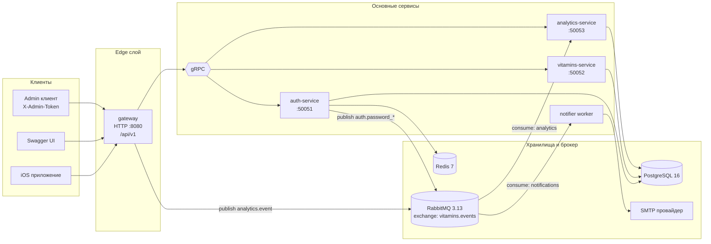

# Системная архитектура VitaInfo backend

Актуально для полного стека `deploy/docker-compose.yml`.

```mermaid
flowchart LR
  %% Clients
  subgraph C[Клиенты]
    ios[iOS приложение]
    swagger[Swagger UI]
    admin[Admin клиент\nX-Admin-Token]
  end

  %% Edge
  subgraph E[Edge слой]
    gw[gateway\nHTTP :8080\n/api/v1]
  end

  %% Core services
  subgraph S[Основные сервисы]
    rpc{{gRPC}}
    auth[auth-service\n:50051]
    vit[vitamins-service\n:50052]
    an[analytics-service\n:50053]
    notifier[notifier worker]
  end

  %% Data
  subgraph D[Хранилища и брокер]
    pg[(PostgreSQL 16)]
    redis[(Redis 7)]
    rmq[(RabbitMQ 3.13\nexchange: vitamins.events)]
    smtp[SMTP провайдер]
  end

  ios --> gw
  swagger --> gw
  admin --> gw

  gw --> rpc
  rpc --> auth
  rpc --> vit
  rpc --> an

  auth --> pg
  vit --> pg
  an --> pg
  auth --> redis

  auth -->|publish auth.password_*| rmq
  gw -->|publish analytics.event| rmq
  rmq -->|consume: analytics| an
  rmq -->|consume: notifications| notifier
  notifier --> smtp
```
